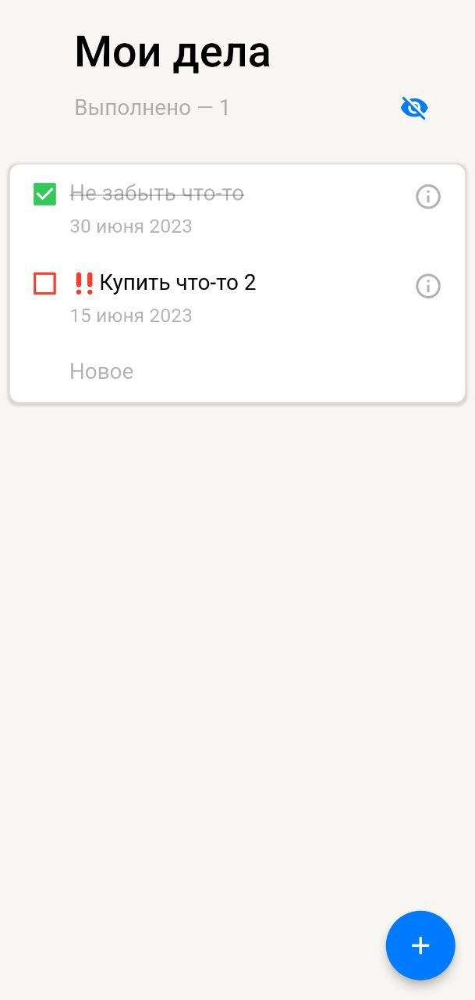
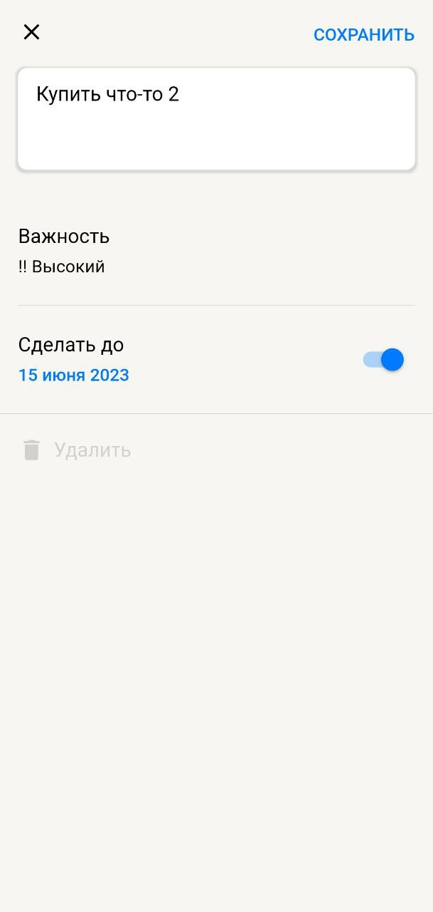
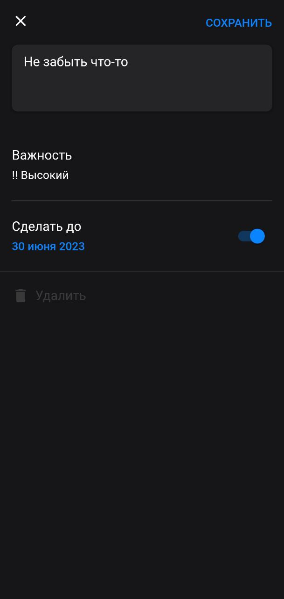
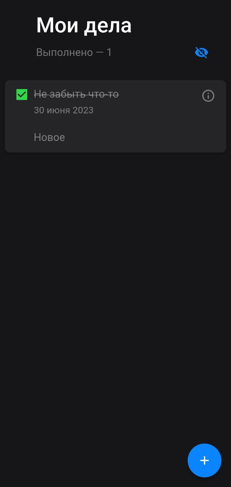
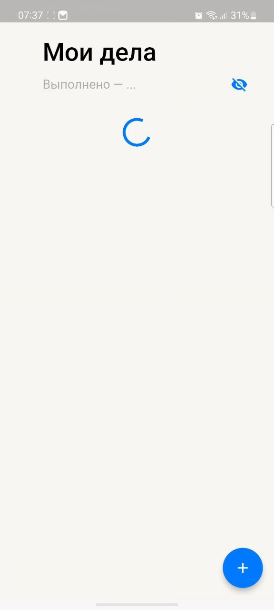

<h1 align="center">
   
  
   
  Todo App
   
</h1>

## UI

  
  
  
  
  

## Features

* Adding and removing tasks
* Filter tasks for undone
* Prioritize tasks
* Set a deadline for the task

## New features (06.07.2023)
* Added task synchronization
* Added deeplinks
* Added Unit-tests
* Changed navigator to Navigator 2.0

## How to run in debug
* Go to `lib/env.dart `
* Redefine `apiBaseUrl` and `apiServiceToken` variables (Actually `apiBaseUrl` is a base url + path, e.g. `https://baseurl/path`)

## Some adb commands to check the Deeplinks
Before launching it, make sure that deep links are allowed in the Settings

*  `./adb shell am start -a android.intent.action.VIEW -c android.intent.category.BROWSABLE -d 'http://todoapp.ru/task_editing_page/51a40289-cf99-40e2-bd57-f1f41634e37f'`
*  `./adb shell am start -a android.intent.action.VIEW -c android.intent.category.BROWSABLE -d 'http://todoapp.ru/task_editing_page/4db1c35d-999f-4597-ae36-bcfc51ffe8e9'`
*  `./adb shell am start -a android.intent.action.VIEW -c android.intent.category.BROWSABLE -d 'http://todoapp.ru/task_creation_page'` 

## Download
<a href="https://github.com/aa1dar/MyTodoApp/releases/tag/1.1.0">Tap me )<a>
